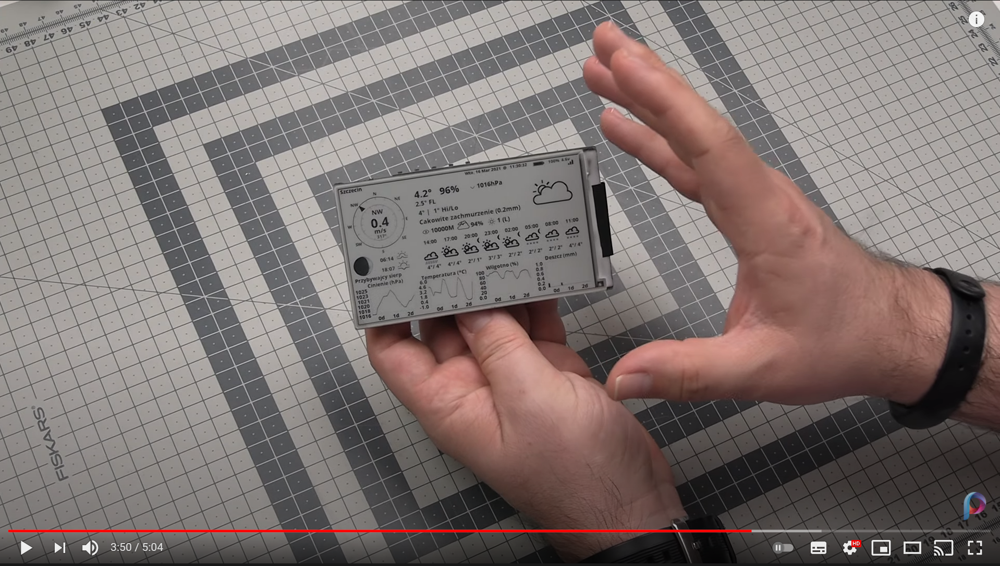

# Project History & Licensing

## Original Presentation Video

DzikuVx originally presented the project in a YouTube video, which has since been removed. The thumbnail is preserved here for historical reference.

## Origin

This project is a fork of [DzikuVx](https://github.com/DzikuVx/LilyGo-EPD-4-7-OWM-Weather-Display)'s repo for the OpenWeather weather station display, which itself was originally created by [G6EJD](https://github.com/G6EJD/).

DzikuVx also presented the project in a YouTube video, which has since been removed. The thumbnail is preserved here for historical reference.

## Licensing

The original code used the [LilyGo-EPD47](https://github.com/Xinyuan-LilyGO/LilyGo-EPD47) library, which is licensed under GPLv3. As the [GPL FAQ explains](https://www.gnu.org/licenses/gpl-faq.html#IfLibraryIsGPL):

> If a library is released under the GPL (not the LGPL), does that mean that any software which uses it has to be under the GPL or a GPL-compatible license?

> Yes, because the program actually links to the library. As such, the terms of the GPL apply to the entire combination. The software modules that link with the library may be under various GPL compatible licenses, but the work as a whole must be licensed under the GPL.

This means the proprietary license that G6EJD applied to the original code is incompatible with GPLv3 and therefore unlawful.

DzikuVx's fork corrected that by applying the GPLv3 to the project, while preserving all attribution and copyright of the original creator.
